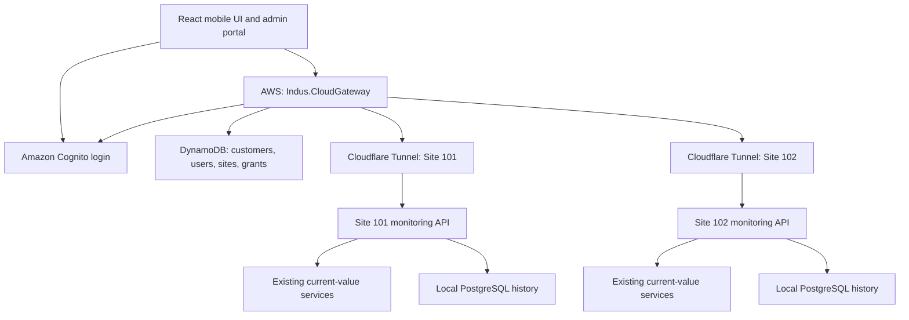

# iNDUS Remote Monitoring — Implementation Plan

Date: 30 September 2026  
Status: Proposed design for implementation  
Scope: React mobile monitoring, administrator setup, user login, assigned-site access, AWS gateway, and Cloudflare site connectivity.

## 1. Proposed solution

Host `Indus.CloudGateway` on AWS. Provide a React web application that works on mobile screens, initially as a responsive PWA. If a native Android/iOS application is required, use React Native with the same central API contracts.

Administrators log in to create customers, register sites, invite users, and assign site permissions. Users log in and see only their assigned sites. All application requests and live connections use one central address, such as `https://api.indusautomation.com`.

Each plant retains its existing iNDUS services and PostgreSQL database. Add a read-only `Indus.RemoteMonitoring.Api` and a Cloudflare Tunnel on the site PC. The AWS gateway retrieves permitted data through the site's tunnel and relays live updates to the mobile application.

Use **Amazon Cognito for authentication** and **DynamoDB for application metadata and permissions**. MongoDB Atlas is an alternative for that metadata. Do not implement both database providers in the first release unless deployment requirements demand it.

These names and domains are examples; substitute the actual owned domain during deployment.

## 2. Architecture and responsibilities



The arrows to tunnels represent application request flow. The `cloudflared` process at each site establishes the underlying outbound connection to Cloudflare; AWS does not establish a direct inbound connection to the plant router. [S1]

| Component | Responsibility | Location |
| --- | --- | --- |
| React UI | Login entry, site selection, dashboards, alarms, trends, administration | Static hosting; runs in user browser |
| Cognito user pool | Credentials, login, invitation, password reset, MFA, token issuance | AWS |
| Indus.CloudGateway | Token validation, permissions, site routing, REST API, live relay | AWS compute |
| Application database | Customer records, profiles, site registry, grants, audit records | DynamoDB or MongoDB Atlas |
| Cloudflare Access | Machine authentication before requests reach a site's tunnel | Cloudflare |
| cloudflared | Persistent outbound tunnel connector | Each site PC |
| Indus.RemoteMonitoring.Api | Bounded read-only access to live and historical data | Each site PC |
| Existing iNDUS services | Device communication, local processing and operation | Each site PC |
| PostgreSQL | Plant history, events and local persistence | Each site PC |

The cloud platform is for monitoring. Plant control and protection continue locally. Remote writes, setpoints, breaker commands, alarm acknowledgement, and equipment control are outside release 1.

## 3. Hosting on AWS

### Pilot deployment

- One Linux EC2 instance running the ASP.NET Core gateway under a supervised service or container.
- HTTPS reverse proxy with a trusted certificate and WebSocket support.
- Gateway application bound to a private/local interface behind the proxy.
- React static application on S3 behind CloudFront, using a private S3 bucket and origin access control.
- Cognito user pool for identity.
- DynamoDB for application data; initially use on-demand capacity and monitor actual usage.
- Secrets Manager for Cloudflare service credentials and other application secrets.
- EC2 instance role for AWS access; do not put AWS access keys in application configuration.
- CloudWatch for logs, operational metrics and alerting.

A single instance is an acceptable pilot tradeoff, but it is a single point of failure. Do not describe it as a highly available production deployment.

### Production deployment

- Application Load Balancer terminating HTTPS, with appropriate idle timeout for live connections.
- ECS/Fargate gateway tasks across availability zones.
- Shared live-stream distribution and cache when more than one gateway instance is used.
- DynamoDB backups and point-in-time recovery; equivalent managed backup policies if using Atlas.
- Deployment health checks, rolling replacement, rollback and infrastructure as code.

SignalR scale-out requires deliberate design. A Redis backplane distributes messages between gateway instances; shared current-value storage is a separate responsibility. Sticky sessions are generally required unless a documented exception applies, such as WebSocket-only clients with negotiation skipped. [S8]

Do not insert Amazon API Gateway into the SignalR path without designing and testing the integration. Its WebSocket API is not automatically a transparent ASP.NET Core SignalR endpoint. The initial gateway can run behind a conventional reverse proxy or load balancer.

Choose the AWS region after measuring connectivity from representative plants and users. Mumbai and Singapore are candidates for the stated India/South Asia/Southeast Asia deployment; no universal latency ranking is assumed.

## 4. Domain and Cloudflare setup

One domain is sufficient for many sites.

| Example hostname | Destination | Intended caller |
| --- | --- | --- |
| `monitor.indusautomation.com` | React application | Users and administrators |
| `api.indusautomation.com` | AWS gateway | React / React Native |
| `auth.indusautomation.com` | Optional Cognito custom domain | Login browser |
| `site101-api.indusautomation.com` | Tunnel for Site 101 | AWS gateway only |
| `site102-api.indusautomation.com` | Tunnel for Site 102 | AWS gateway only |

React does not receive the site endpoint or any tunnel/access credentials. The cloud database maps site IDs to approved endpoints.

### Existing AWS domain

Domain registration and authoritative DNS are separate. Keep the domain registered with AWS if desired.

For ordinary Cloudflare full setup, move authoritative DNS to Cloudflare after copying and validating all existing records, including website, email, MX, TXT, SPF, DKIM and verification records. AWS-hosted services can continue to run on AWS. Coordinate DNSSEC and nameserver changes as part of the migration. [S2]

If keeping Route 53 authoritative is required, evaluate Cloudflare partial/CNAME setup. Cloudflare documents this as a Business/Enterprise option. Do not assume adding a Route 53 CNAME alone provides the standard free full-setup tunnel arrangement. Separately delegated subdomain configurations also have their own eligibility requirements. [S2]

### Site onboarding sequence

1. Verify the monitoring API works locally, for example `http://127.0.0.1:7000/health`.
2. Create a separate remotely managed tunnel for that site.
3. Install `cloudflared` as a Windows service using the command generated for that tunnel.
4. Route the site's hostname to `http://127.0.0.1:7000`.
5. Protect the hostname with a Cloudflare Access **Service Auth** policy allowing only that site's gateway service credential.
6. Configure supported Access-token validation at the connector/origin boundary, with the expected Access application audience. Verify it for the selected Service Auth setup. Add independent application machine authentication if that boundary cannot be enforced as intended.
7. Store gateway service secrets in Secrets Manager; store the tunnel connector token securely at the site. These are different credentials.
8. Permit the documented outbound tunnel connectivity; restrictive firewalls need the Cloudflare destinations and port `7844` for the selected transport. Validate against current installation documentation. [S1]
9. Confirm an unauthenticated request to the site hostname is rejected and a gateway request succeeds.
10. Register the approved endpoint and secret reference in the cloud site registry.

Use one scoped gateway service credential per site, with rotation and expiry monitoring. Cloudflare service tokens are intended for automated systems and include a client ID and secret. They stay on the gateway, never in frontend code. [S3]

Only expose the dedicated monitoring service. Keep PostgreSQL and existing internal service endpoints private. Bind the monitoring listener to loopback when the connector runs on the same PC. Protect local internal access according to existing iNDUS authentication rules; do not bypass the Host service's mTLS/JWT protections.

## 5. Administrator and user access

### Roles

| Role | Allowed actions |
| --- | --- |
| PlatformAdmin | Manage customers, sites, users, assignments and platform settings across customers |
| CustomerAdmin, optional later | Manage permitted users and assignments inside their own customer only |
| MonitoringUser | Read assigned sites according to specific grants |

Release 1 requires PlatformAdmin and MonitoringUser. CustomerAdmin can be added after its delegation rules are implemented and tested.

Customer ownership does not automatically grant every user access to every customer site. Store explicit site grants. A PlatformAdmin's cross-customer access is a deliberate privileged policy and all changes are audited.

### Administrator pages

| Page | Functions |
| --- | --- |
| Login | Secure sign-in with administrator MFA |
| Customers | Create, edit, deactivate customer records |
| Sites | Register site, assign customer, enter verified connection settings, test connectivity |
| Users | Invite user, edit profile, disable account, resend invitation, initiate reset |
| Site assignments | Grant/revoke site access and individual read permissions |
| Audit | View administrator actions and access changes |
| System health | Gateway health, site reachability, stream status, credential expiry |

Endpoint settings use approved hostnames and validated route configuration. Never allow ordinary users to supply arbitrary URLs for the gateway to fetch.

### Example assignments

| User | Customer | Site 101 | Site 102 | Site 103 |
| --- | --- | --- | --- | --- |
| Engineer A | ABC Hydro | Live, alarms, events, trends | Live, alarms | No access |
| Manager B | ABC Hydro | Live, trends | No access | No access |
| Operator C | XYZ Hydro | No access | No access | Live, alarms, events |

Hiding unassigned sites in React is a convenience. The gateway must enforce the same rules independently.

## 6. Login, invitation and account lifecycle

Use Cognito for identities whether the application database is DynamoDB or MongoDB. Store profiles and grants in the application database; do not store passwords there.

### First administrator

Create the first PlatformAdmin using a controlled deployment/bootstrap procedure. Create the Cognito identity, link its immutable `sub` to the application profile, activate the role, enroll MFA, then disable/remove the bootstrap path. There is no public administrator-registration endpoint.

### Administrator creates a user

1. Administrator signs in and submits name, email, customer and selected sites.
2. Gateway verifies current administrator status and validates that all assignments belong to the intended customer.
3. Gateway creates the identity through Cognito's administrator API and creates a pending application profile.
4. Cognito sends its configured invitation / first-login instructions. [S4]
5. Gateway creates the site grants and records the administrator action.
6. User completes first-login requirements and MFA if required, then can enter the application.

Cognito and the application database cannot share one database transaction. Track a provisioning operation ID and state, make retries idempotent, and reconcile partial failures. Pending/incomplete users must not receive active access. Do not accidentally create duplicate accounts when an invitation request is retried.

### Login flow

Use Cognito authorization code flow with PKCE for public browser/mobile clients, with no embedded client secret. [S5]

1. User presses Login and is redirected to Cognito's managed login.
2. After successful authentication, the app completes the code exchange with PKCE.
3. App calls `GET /api/me` with the access token.
4. Gateway validates signature, issuer, expiry, token use, expected app client and configured API scopes/audience where applicable.
5. Gateway loads the active application profile by Cognito `sub` and rejects pending/disabled profiles.
6. App calls `GET /api/sites` and receives only permitted active sites.

Use an **access token** for API authorization. An ID token is not a substitute. Validate Cognito token claims according to the actual token type and resource-server configuration.

React Native should use the system authentication browser and platform secure token storage. For a browser PWA, prefer a same-origin backend-for-frontend with Secure, HttpOnly session cookies and CSRF protection if persistent sessions are required. If using a direct SPA token model, keep tokens in memory where practical and explicitly review refresh-token storage and XSS exposure; do not default to persistent localStorage.

### Disabled accounts and revoked assignments

Disabling a user in the application database immediately blocks subsequent gateway checks even if an issued identity token remains valid. Also disable the Cognito identity and terminate tracked live sessions.

Removing a site grant blocks new requests, removes existing subscriptions, and closes or updates affected streams. Use a shared permission-change notification mechanism when multiple gateway instances are present. Periodic revalidation is a fallback, not the only revocation mechanism. Set a proposed maximum revocation delay of 5 seconds, verified by tests.

## 7. Mandatory authorization rules

For each REST request and every live subscription:

1. Validate authentication.
2. Load the active user profile and current authoritative role.
3. Load the requested active site.
4. Check the explicit user-to-site grant and requested capability.
5. Enforce customer ownership; exception only for the documented PlatformAdmin policy.
6. Query the site's approved endpoint.

Use the server-resolved site context for all subsequent tag, alarm, event and trend queries. Never trust client-supplied `customerId`, SignalR group names, endpoint URLs or role flags.

Permissions: `Live.Read`, `Alarms.Read`, `Events.Read`, `Trends.Read`. Administrator capabilities are separate from these site read grants.

Example: changing `/api/sites/101/live` to `/api/sites/103/live` must be rejected when Site 103 is unassigned, even if the user knows the site ID. Apply the same rule to detail endpoints, exports, cached responses and hubs.

Avoid treating a JWT's old group claims as the sole source of changing site permissions. Check current application state. For DynamoDB, use strongly consistent base-table reads for authorization-critical profile/site/grant lookups; GSIs do not offer strongly consistent reads. [S6]

## 8. Database plan

### Storage split

| Data | Initial storage |
| --- | --- |
| Passwords and identity verification | Cognito |
| Customers, profiles, sites, grants | DynamoDB, or MongoDB Atlas |
| Administrator audit records | Application database, with protected archive later |
| Current values | Existing site cache; gateway in-memory cache |
| High-rate raw plant history | Existing site PostgreSQL |
| Cloudflare and application secrets | Secrets Manager |
| Future historical exports/archive | Object storage or dedicated history service |

Do not write every incoming tag update into the metadata database. It is not required for live fan-out. If retaining cloud telemetry later, choose the schema, retention and write rate separately.

### DynamoDB versus MongoDB Atlas

| Criterion | DynamoDB | MongoDB Atlas |
| --- | --- | --- |
| Best fit here | Defined lookups for profiles, registry and permissions | More flexible evolving document queries and reporting |
| Modeling approach | Design keys and indexes around known access patterns | Design documents and compound indexes around queries |
| AWS integration | Natural fit with IAM-based AWS application access | Managed Atlas cluster on AWS with configured database/network access |
| Permission consistency | Strong reads on tables; eventual reads on GSIs [S6] | Configure authoritative read/write behavior for grants and revocation |
| Transactions | Supported for bounded related writes [S7] | Available; avoid unnecessary multi-document coupling |
| High-rate telemetry | Requires a separate deliberate key/write/retention design | Requires a separate deliberate time-series and retention design |
| Recommendation | Default for this AWS-focused metadata workload | Choose if flexible document queries are a stronger team requirement |

This recommendation is a design judgment for iNDUS, not a universal performance or cost claim. Actual cost depends on traffic, retention, indexing and deployment choices. MongoDB compound indexes must reflect query shapes. [S9]

### Proposed DynamoDB tables

Use several small-purpose tables for clarity in release 1. Do not introduce a complex single-table design just to minimize table count.

| Table | Primary key | Main attributes / access pattern |
| --- | --- | --- |
| Customers | `customerId` | Name, status, createdAt, version |
| Users | `userId` = Cognito `sub` | CustomerId, name, normalized email, role, status, version |
| Sites | `siteId` | CustomerId, name, status, endpoint, tunnelId, secretRef, version |
| UserSiteGrants | PK `userId`, SK `siteId` | Permissions, status, assignedBy, assignedAt, version |
| AuditEvents | PK `scopeMonth`, SK `timestamp#eventId` | Actor, operation, target, sanitized change, correlationId |
| ProvisioningOperations | `operationId` | Request fingerprint, progress, result IDs, retry state |

Indexes: Users by customer, Sites by customer, and UserSiteGrants by site for administrator listing/revocation. These list views can tolerate eventual consistency; confirm authoritative records before granting access or executing mutations.

`scopeMonth` represents a customer/month or platform/month bucket. Add shards if audit write volume creates a hot partition. All list APIs are paginated. No full-table scan is used to answer ordinary mobile access requests.

For `/api/sites`, query the user's base-table grants with strong consistency, then read authoritative site records. Never trust an eventually consistent reverse index to authorize a request.

Use conditional version checks for administrator edits and transactional writes for related grant/audit changes where appropriate. DynamoDB transactions do not make an eventually consistent read strongly consistent. [S7]

Archive and expire audit data only according to an approved retention policy. Expiry fields are not authorization decisions; check expiry explicitly at request time.

### Equivalent MongoDB collections

Use `customers`, `users`, `sites`, `userSiteGrants`, `auditEvents`, and `provisioningOperations`.

- Unique indexes on `customerId`, `userId`, and `siteId` in their collections.
- Unique compound index on `(userId, siteId)` in grants.
- Index sites on `(customerId, status)` and users on `(customerId, status)`.
- Reverse grant index on `(siteId, userId)`.
- Audit index on `(customerId, createdAt, eventId)`.
- Use an email uniqueness policy consistent with the identity provider; email is not the permanent authorization key.
- Use conditional version filters for competing edits and transactions where a coordinated change is required.
- Use managed backup, encrypted connectivity and restricted network access. Do not make the database a frontend endpoint.

### Example site and grant

```json
{
  "siteId": "101",
  "customerId": "ABC-HYDRO",
  "name": "Hydro Plant A",
  "status": "Active",
  "endpoint": "https://site101-api.indusautomation.com",
  "secretRef": "indus/sites/101/cloudflare-access",
  "version": 1
}
```

```json
{
  "userId": "cognito-sub-example",
  "siteId": "101",
  "permissions": ["Live.Read", "Alarms.Read", "Trends.Read"],
  "status": "Active",
  "assignedBy": "admin-sub-example",
  "version": 1
}
```

The normal user's site response contains a site ID, display name, permissions and health information. It omits endpoint and secret references.

## 9. Data delivery and live updates

### Current values

Read live values from existing iNDUS current-value services/cache through supported authenticated interfaces. Avoid PostgreSQL queries for every live point or screen refresh. Inspect the actual Host service interfaces before implementation; no particular existing route or cache API is assumed by this plan.

Use one upstream site connection per active site per coordinated relay owner, shared by all authorized viewers. Do not open one site connection for every phone.

Initial configuration proposals:

- Coalesce ordinary measurement updates into batches every 250–1,000 ms, configurable per site and tag class.
- Forward alarms and discrete state changes promptly; do not discard transitions through measurement coalescing.
- Stop unused upstream subscriptions after an idle grace period.
- Limit tags, message size and subscriptions per user/site.
- Bound outgoing queues; coalesce replaceable measurements for slow viewers, then force resnapshot if necessary.

When a user subscribes, authorize first, acquire a snapshot with a stream cursor, and deliver subsequent deltas without a gap. A replay buffer or snapshot/resnapshot protocol must handle the snapshot-to-stream race. On reconnect, reauthenticate, reauthorize and obtain a fresh snapshot or replay from a supported cursor.

```json
{
  "siteId": "101",
  "streamEpoch": "site-session-example",
  "sequence": 18421,
  "receivedAtUtc": "2026-09-30T11:15:00Z",
  "values": [
    {
      "tagId": "UNIT1_SPEED",
      "value": 99.98,
      "unit": "%",
      "sourceTimestampUtc": "2026-09-30T11:14:59.800Z",
      "quality": "Good"
    }
  ]
}
```

Sequence numbers are scoped to a stream epoch; detect gaps and resets. Preserve source quality and source timestamps. UI shows last update time and stale/offline status, rather than displaying old values as current.

### Historical trends and events

React requests the gateway; the gateway authorizes and calls the site's monitoring API; the site API makes bounded PostgreSQL queries with a read-only database account.

Require UTC time bounds, authorized tag IDs, maximum duration, pagination or aggregation, query timeouts, cancellation and a maximum output-point count. For long trends, request downsampled data rather than returning millions of raw samples. Distinguish an empty result from an unreachable site.

History remains unavailable remotely while the site is disconnected in release 1. Cloudflare Tunnel does not replicate or retain PostgreSQL history. If remote history during site outages is required, implement cloud synchronization as a separate phase.

### Latency measurement

Do not promise a fixed 100–300 ms or a fixed ordering of VPN, tunnel and cloud routes. Internet routing, client location, scan cycle, batching and gateway region determine the result.

Measure source-to-screen age, API response time and p50/p95/p99 delay using real mobile networks. Synchronize clocks and record clock-quality information. Treat source-to-receive timing as approximate when clocks differ. Use an initial ordinary-measurement freshness goal of approximately one second under healthy connectivity, then agree the actual requirement from the pilot.

## 10. Proposed API contracts

### Cloud gateway

| Method / route | Purpose | Access |
| --- | --- | --- |
| `GET /api/me` | Current profile and role | Active authenticated user |
| `GET /api/sites` | Assigned sites | Active authenticated user |
| `GET /api/sites/{siteId}/status` | Site health | Authorized site user |
| `GET /api/sites/{siteId}/live` | Current snapshot | Live.Read |
| `GET /api/sites/{siteId}/alarms` | Active alarms | Alarms.Read |
| `GET /api/sites/{siteId}/events` | Paged events | Events.Read |
| `GET /api/sites/{siteId}/trends` | Bounded trend data | Trends.Read |
| `/hubs/live` | Authorized site/tag subscription | Checked on every subscription |
| `POST /api/admin/customers` | Create customer | PlatformAdmin |
| `POST /api/admin/sites` | Register site | PlatformAdmin |
| `POST /api/admin/sites/{siteId}/test-connection` | Validate registered endpoint | PlatformAdmin |
| `POST /api/admin/users` | Provision/invite user | PlatformAdmin |
| `PUT /api/admin/users/{userId}/sites/{siteId}` | Set grant | PlatformAdmin |
| `DELETE /api/admin/users/{userId}/sites/{siteId}` | Revoke grant | PlatformAdmin |
| `POST /api/admin/users/{userId}/disable` | Disable access | PlatformAdmin |
| `GET /api/admin/audit` | Paged audit records | PlatformAdmin |

Administrator list/edit routes complete these resources using pagination and version checks. Login/password-reset redirects and endpoints follow Cognito's actual integration, rather than an invented gateway password endpoint.

### Site API

Provide `/health`, `/api/monitoring/status`, `/api/monitoring/live`, `/api/monitoring/alarms`, `/api/monitoring/events`, `/api/monitoring/trends`, and `/hubs/monitoring`.

Site APIs accept machine authentication; users authenticate to the central gateway. The gateway authorizes end users before making machine requests. A site enforces its configured identity, bounded reads and approved data scope. No arbitrary SQL, file access or generic internal-service proxy endpoint is provided.

Return stable error codes: `UNAUTHENTICATED`, `ACCESS_DENIED`, `SITE_OFFLINE`, `SITE_TIMEOUT`, `DATA_STALE`, `INVALID_RANGE`, `RATE_LIMITED`. Avoid leaking internal endpoints, credentials or query details in errors.

## 11. Failure behavior and operations

| Condition | Required behavior |
| --- | --- |
| Site internet outage | Local plant services continue; remote UI reports offline/stale |
| Tunnel stopped | Gateway marks unreachable and retries with backoff/jitter |
| Monitoring API stopped | Distinguish from a healthy tunnel; report application unavailable |
| Cloud gateway outage | Local operation continues; clients reconnect after recovery |
| Metadata database unavailable | Fail closed for authorization; do not return unverified plant data |
| Expired user token | Refresh or reauthenticate; stop unauthorized live delivery |
| Removed site grant | Reject REST requests and remove active live access |
| Upstream stream gap/restart | Detect cursor mismatch and resnapshot |
| Slow mobile connection | Bound queues and resynchronize; avoid unbounded memory growth |
| Site credential expired | Alert operator; no insecure bypass fallback |

Use timeout/circuit-breaker isolation per site so one offline plant does not delay every other plant. A cached last-known snapshot must include stale state and still pass authorization.

Log correlation IDs across gateway/site requests. Redact passwords, access tokens, Cloudflare secrets, cookies and sensitive query strings. Some browser SignalR transports carry tokens in query strings; redact those from proxy and application logs.

Monitor active users, upstream connections, update age, upstream retry count, per-site query latency, authorization failures, credential expiry and database usage. Separate customer/site data in cache keys and never CDN-cache authenticated monitoring responses as public data.

Proposed operational policies: daily backup checks, quarterly restore exercises, dependency updates, audited secret rotation and a documented support procedure. Retention periods and recovery objectives are business decisions to confirm before production.

## 12. Development structure

| Project | Purpose |
| --- | --- |
| `Indus.RemoteMonitoring.Api` | Site adapter for existing services/cache/PostgreSQL |
| `Indus.CloudGateway` | Central REST API, authorization, registry routing and live relay |
| `Indus.RemoteMonitoring.Contracts` | Versioned transport DTOs and error contracts |
| `Indus.Monitoring.Web` | Responsive React application and admin pages |
| `Indus.Monitoring.Infrastructure` | AWS provisioning and deployment configuration |
| `Indus.CloudSync.Agent`, later | Outbound telemetry and durable cloud history synchronization |

Keep the site adapter independent of cloud administration. Use versioned data contracts so a gateway deployment does not require all plants to update simultaneously. Configure endpoints and approved secret references on the backend.

## 13. Implementation phases and acceptance gates

### Phase 1 — One-site connectivity prototype

Implement a read-only local status/live endpoint, a named Cloudflare tunnel protected by Access, and an AWS gateway calling it. Measure connectivity from a phone using mobile data.

Acceptance: only the gateway credential reaches the site API; no database/internal-service exposure; local operation continues when cloud connectivity is interrupted.

### Phase 2 — Identity and administration

Create Cognito integration, bootstrap administrator, customers/sites/users/grants, invitation recovery and audit records. Build admin login and management pages plus user login and assigned-site listing.

Acceptance: the admin creates a user and assigns two sites; the user sees only those sites; changing a URL or hub argument to an unassigned site is rejected.

### Phase 3 — Complete monitoring screens

Add measurements, status, active alarms, events and bounded trends. Add SignalR snapshot/delta delivery, reconnect and freshness indicators.

Acceptance: source timestamps and quality are preserved; reconnect produces a correct snapshot; unauthorized subscriptions fail; repeated viewers share upstream connections.

### Phase 4 — Production hardening

Complete load tests, fault tests, account revocation, credential rotation, backup/restore, deployment rollback and operational dashboards. Migrate to multiple gateway instances if uptime/load requirements justify it.

Acceptance: revocation meets the agreed delay, representative concurrency is supported, restore works, and an offline site does not block others.

### Phase 5 — Outbound cloud agent, when justified

Add an agent that pushes live changes/alarms to a central ingestion service, with authenticated site identity. The cloud maintains current values and optionally synchronized history. MQTT, WebSocket or HTTPS ingestion can be selected after traffic requirements are measured.

For durable events/history, use a persisted local outbox, acknowledged uploads, stable event IDs, deduplication, bounded backlog, resume cursors and replay ordering. Coalesce replaceable current values separately from events that must be preserved.

The central user API can retain the same routes. Live routing changes internally from tunnel relay to cloud ingestion/cache; no mandatory mobile redesign is needed. A push-only deployment may no longer need tunnels for routine monitoring, although optional site history access can retain them.

## 14. Verification checklist

- First administrator setup cannot be invoked by a normal user.
- User invitation retries and partial provisioning failures recover without unintended access.
- Disabled/pending users are blocked with previously issued tokens.
- REST, exports, cache and hub methods enforce site/capability/customer permissions.
- Site grant removal removes existing live delivery within the agreed bound.
- Administrator assignment changes reject cross-customer mistakes and conflicting edits.
- Direct site requests without approved machine authentication are rejected.
- No secrets are bundled into React or printed in logs.
- Site query limits prevent expensive unbounded history requests.
- Stream gaps, duplicate updates and site restarts trigger correct resynchronization.
- Snapshot-to-delta transition cannot silently lose an update.
- Failed site, database, gateway and tunnel paths produce accurate UI states.
- Backup restore, credential rotation, deployment rollback and DNS configuration are exercised.
- Load testing measures fan-out, connection limits, memory, bandwidth and update age at the intended site/user/tag counts.

## 15. Cost and sizing inputs

Prepare costs using current provider calculators after the pilot establishes usage. Do not assume all Cloudflare or AWS components are free.

Include AWS compute, load balancer if selected, Cognito users/features, DynamoDB operations/backups, Secrets Manager, logs, static hosting, internet egress and any paid Cloudflare configuration. For Atlas, include cluster size, backups and network traffic.

Capture: site count, concurrent users, tags per site, update interval, average batch size, alarms/events per day, trend query volume and cloud retention requirement.

Illustrative telemetry estimate: 20 sites × 500 monitored tags × 1 update/second = 10,000 tag updates/second before change filtering and batching. Viewer delivery adds separate fan-out bandwidth. This is a sizing illustration, not a selected first-release workload.

Cloud storage of every raw value can dominate costs. Start with metadata in DynamoDB, live relay/cache, and local PostgreSQL history; measure before adding full cloud replication.

## 16. Decisions before implementation

| Decision | Proposed default |
| --- | --- |
| Mobile format | Responsive React PWA initially; React Native if native installation is required |
| Identity | Cognito, invitations only; no public self-registration |
| Metadata database | DynamoDB |
| Alternative metadata database | MongoDB Atlas on AWS |
| Initial gateway hosting | One EC2 pilot; HA deployment before an uptime commitment |
| Initial site transport | Named Cloudflare tunnel with per-site machine access |
| Monitoring permissions | Read-only live, alarms, events and trends |
| Historical storage | Existing PostgreSQL at each plant |
| Administrator scope | PlatformAdmin first; customer delegation later |
| DNS | Existing AWS registration; Cloudflare full DNS setup unless Route 53 must remain authoritative |
| Offline remote history | Not included until cloud history sync is implemented |
| Measurement freshness | Pilot goal around one second; measured and agreed before production |

This document is an implementation plan. It does not create AWS resources, change DNS, register tunnels, or provision accounts.

## 17. Official references

Provider details were checked on 30 September 2026. Confirm selected plans, regions and deployment settings during implementation.

- **[S1] Cloudflare Tunnel setup:** https://developers.cloudflare.com/tunnel/get-started/
- **[S2] Cloudflare DNS full and partial setup:** https://developers.cloudflare.com/dns/zone-setups/full-setup/ and https://developers.cloudflare.com/dns/zone-setups/partial-setup/
- **[S3] Cloudflare service credentials:** https://developers.cloudflare.com/cloudflare-one/access-controls/service-credentials/service-tokens/
- **[S4] Cognito administrator user creation:** https://docs.aws.amazon.com/cognito/latest/developerguide/how-to-create-user-accounts.html
- **[S5] Cognito PKCE:** https://docs.aws.amazon.com/cognito/latest/developerguide/using-pkce-in-authorization-code.html
- **[S6] DynamoDB read consistency:** https://docs.aws.amazon.com/amazondynamodb/latest/developerguide/HowItWorks.ReadConsistency.html
- **[S7] DynamoDB transactions:** https://docs.aws.amazon.com/amazondynamodb/latest/developerguide/transaction-apis.html
- **[S8] ASP.NET Core SignalR hosting/scaling:** https://learn.microsoft.com/en-us/aspnet/core/signalr/scale and https://learn.microsoft.com/en-us/aspnet/core/signalr/redis-backplane
- **[S9] MongoDB query-oriented indexes:** https://www.mongodb.com/docs/manual/data-modeling/schema-design-process/create-indexes/
